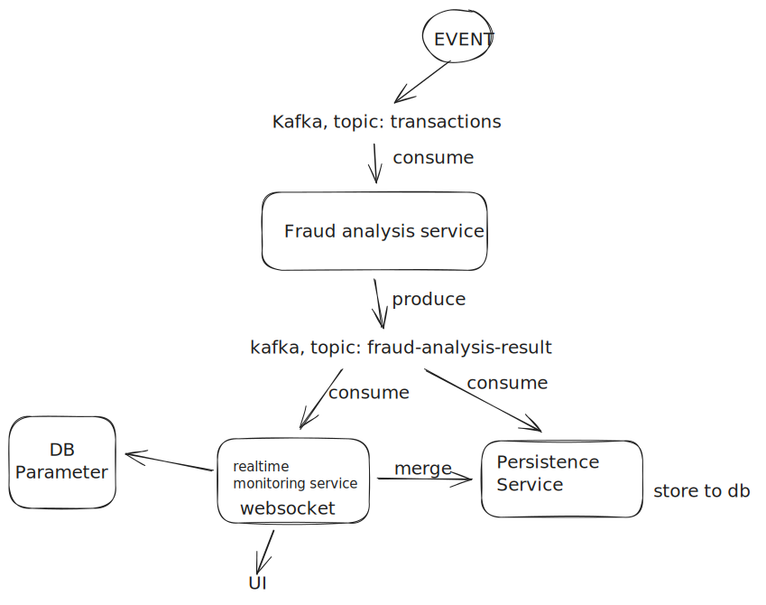
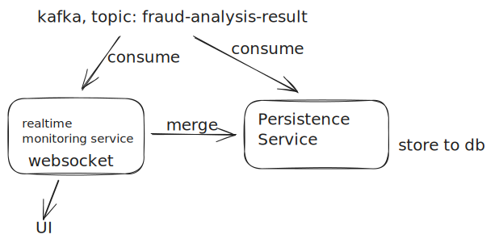

# FDS Service

Services to handle real time monitoring and storing persistence data of transactions data.

Here leveraging data stream mechanism by Kafka.

Built using Go with Gin, Websocket, Kafka, SQL DB.

---

## Future-Proof Architecture for me

## Decided Architecture for achieving MVP ASAP

